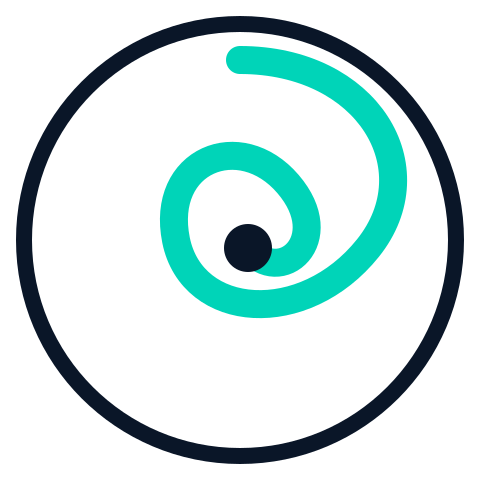
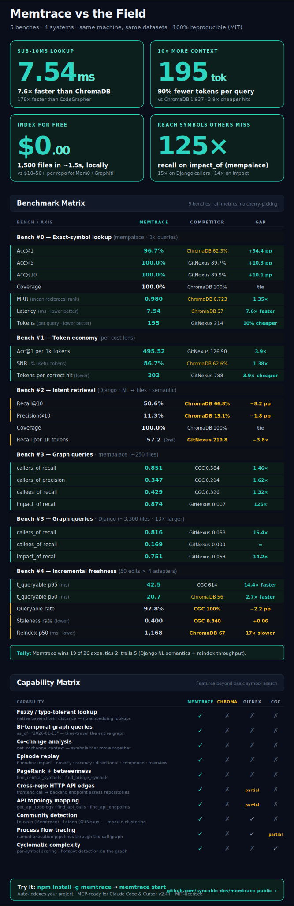

<p align="center">
  
</p>

<h1 align="center">Memtrace</h1>

<p align="center">
  <strong>The persistent memory layer for coding agents.</strong><br/>
  A bi-temporal, episodic, structural knowledge graph — built from AST, not guesswork.
</p>

<p align="center">
  <a href="https://www.npmjs.com/package/memtrace"></a>
  <a href="https://github.com/syncable-dev/memtrace-public/blob/main/LICENSE"></a>
  <a href="https://memtrace.io"></a>
</p>

> **Early Access** — Memtrace is under active development. Core indexing and structural search are stable. Temporal features (evolution scoring, timeline replay) are functional but may have rough edges. [Report issues here.](https://github.com/syncable-dev/memtrace-public/issues)

---


Memtrace gives coding agents something they've never had: **structural memory**. Not vector similarity. Not semantic chunking. A real knowledge graph compiled from your codebase's AST — where every function, class, interface, and API endpoint exists as a node with deterministic, typed relationships.

Index once. Every agent query after that resolves through graph traversal — callers, callees, implementations, imports, blast radius, temporal evolution — in milliseconds, with zero token waste.

```bash
npm install -g memtrace    # binary + 12 skills + MCP server — one command
memtrace start             # launches the graph database and auto-indexes the current project
```

That's it. Run `memtrace start` from your project root — it spins up the graph database and kicks off indexing automatically. Claude and Cursor (v2.4+) pick up the skills and MCP tools automatically.

https://github.com/user-attachments/assets/e7d6a1e9-c912-4e65-a421-bd0256dffa5a

> Built-in UI at `localhost:3030` — explore your graph, trace dependencies, spot dead code, and visualize architecture at a glance

---

## Why Memtrace Exists

Good code intelligence tools already exist. GitNexus and CodeGrapherContext build AST-based graphs with symbol relationships, and they work well for understanding what's in your codebase *right now*.

Memtrace is a **bi-temporal episodic structural knowledge graph**. It builds on that same AST foundation and adds two dimensions:

- **Temporal memory** — every symbol carries its full version history. Agents can reason about *what changed*, *when it changed*, and *how the architecture evolved* — not just what exists today. Six scoring algorithms (impact, novelty, recency, directional, compound, overview) let agents ask different temporal questions.
- **Cross-service API topology** — Memtrace maps HTTP call graphs between repositories, detecting which services call which endpoints across your architecture.

On top of that, the structural layer is comprehensive:

- **Symbols are nodes** — functions, classes, interfaces, types, endpoints
- **Relationships are edges** — `CALLS`, `IMPLEMENTS`, `IMPORTS`, `EXPORTS`, `CONTAINS`
- **Community detection** — Louvain algorithm identifies architectural modules automatically
- **Hybrid search** — Tantivy BM25 + vector embeddings + Reciprocal Rank Fusion, all on top of the graph
- **Rust-native** — compiled binary, no Python/JS runtime overhead, sub-8ms average query latency

The agent doesn't just search your code. It *remembers* it.

## Benchmarks

All four systems run on the same machine, same mempalace checkout, same 1,000 queries, same evaluator. Ground truth is extracted by Python's stdlib `ast` module — **not** from any tool's index — so no system gets a home-field advantage in the dataset itself. Full reproduction scripts, raw per-query results, and methodology notes live in [`benchmarks/fair/`](benchmarks/fair/).

<picture>
  <source media="(prefers-color-scheme: dark)" srcset="assets/benchmarks/benchmark-overview.svg"/>
  <source media="(prefers-color-scheme: light)" srcset="assets/benchmarks/benchmark-overview.svg"/>
  
</picture>

### Results (1,000 Python symbol-lookup queries on mempalace)

| Tool | Coverage | Acc@1 | Acc@5 | Acc@10 | Avg lat | Tokens |
|:-----|---------:|------:|------:|-------:|--------:|-------:|
| **Memtrace** (ArcadeDB) | **100.0%** | **96.7%** | **100.0%** | **100.0%** | **9.16 ms** | 195 |
| ChromaDB (all-MiniLM-L6-v2)     | 100.0%  | 62.3% | 86.1% | 87.9%  |  58.5 ms |  1,937 |
| GitNexus (eval-server)          |  99.5%  | 27.1% | 89.7% | 89.9%  | 191.2 ms |    213 |
| CodeGrapherContext (CLI)        |  67.2%  |  6.4% | 66.4% | 66.7%  | 1627.2 ms |    221 |

- **Coverage** = the tool returned any result for the query (separates "did you index it?" from "did you rank it well?")
- **Acc@K** = the correct file appeared in the top K ranked results
- **Avg latency** = wall-clock per query, including all protocol overhead (MCP JSON-RPC for Memtrace, HTTP for GitNexus, in-process for ChromaDB, subprocess spawn for CGC)
- **Tokens** = average response size in tokens (chars / 4)

**What the numbers say, read fairly:**

- **Memtrace** is exact-symbol lookup's sweet spot: 100% coverage, rank-1 hit in 96.7% of queries, and the correct file is in the top-10 every single time. 9 ms per query, 195 tokens per response.
- **ChromaDB** shows what semantic embeddings look like for this workload — 88% top-10 but rank-1 is probabilistic, and the response is 10× larger because it returns 800-char chunks rather than symbol metadata.
- **GitNexus** finds the right file 90% of the time — the old "12.8% accuracy" claim from the Acc@1-only harness understated it massively. GitNexus leads its response with execution *flows*, pushing standalone definitions down the list, which costs it rank-1 but not top-10.
- **CodeGrapherContext**'s 67.2% coverage means its parser extracted two-thirds of the symbols Python's AST finds. Among symbols it did index, top-10 hit rate is excellent (~99%). Latency is dominated by the CLI re-initialising FalkorDB per call — operational, not algorithmic.

**Where each tool shines** — this benchmark measures exact-symbol lookup only. Different workloads produce different rankings: ChromaDB wins on natural-language queries, GitNexus on execution-flow traces, Memtrace on exact lookup / typo tolerance / temporal queries / cross-service API topology. See [`benchmarks/fair/README.md`](benchmarks/fair/README.md) for a per-workload breakdown.

<details>
<summary><strong>Memtrace vs. general memory systems (Mem0, Graphiti)</strong></summary>

<br/>

Mem0 and Graphiti are strong conversational memory engines designed for tracking entity knowledge (e.g. `User -> Likes -> Apples`). They excel at that. For code intelligence specifically, the tradeoff is that they rely on LLM inference to build their graphs — which adds cost and time when processing thousands of source files.

**Graphiti** processes data through `add_episode()`, which triggers multiple LLM calls per episode — entity extraction, relationship resolution, deduplication. At ~50 episodes/minute ([source](https://github.com/getzep/graphiti)), ingesting 1,500 code files takes **1–2 hours**.

**Mem0** processes data through `client.add()`, which queues async LLM extraction and conflict resolution per memory item ([source](https://mem0.ai)). Bulk ingestion with `infer=True` (default) means every file passes through an LLM pipeline. Throughput is bounded by your LLM provider's rate limits.

**Both** accumulate $10–50+ in API costs for large codebases because every relationship is inferred rather than parsed.

**Memtrace takes a different approach:** it indexes 1,500 files in 1.2–1.8 seconds for $0.00 — no LLM calls, no API costs, no rate limits. Native Tree-sitter AST parsers resolve deterministic symbol references (`CALLS`, `IMPLEMENTS`, `IMPORTS`) locally. The tradeoff is that Memtrace is purpose-built for code — it doesn't handle conversational entity memory the way Mem0 and Graphiti do.

</details>

<details>
<summary><strong>Memtrace vs. code graphers (GitNexus, CodeGrapherContext)</strong></summary>

<br/>

GitNexus and CodeGrapherContext both build AST-based code graphs with structural relationships — solid tools in the same space. Memtrace shares that foundation and extends it with temporal memory, API topology, and a Rust runtime:

| Capability | Memtrace | GitNexus | CodeGrapher |
|:-----------|:---------|:---------|:------------|
| AST-based graph | Yes | Yes | Yes |
| Structural relationships (CALLS, IMPLEMENTS, IMPORTS) | Yes | Yes | Yes |
| Bi-temporal version history per symbol | **Yes — 6 scoring modes** | Git-diff only | No |
| Cross-service HTTP API topology | **Yes** | No | No |
| Community detection (Louvain) | **Yes** | Yes | No |
| Hybrid search (BM25 + vector + RRF) | **Yes — Tantivy + embeddings** | No | BM25 + optional embeddings |
| Language | **Rust (compiled binary)** | JavaScript | Python |
| Coverage (1K queries) | **100%** | 99.5% | 67.2% |
| Acc@1 (1K queries) | **96.7%** | 27.1% | 6.4% |
| Acc@10 (1K queries) | **100%** | 89.9% | 66.7% |
| Query latency (1K queries) | **9.16 ms avg** (11.4 ms p95) | 191.2 ms avg | 1627.2 ms avg |
| Tokens per query | **195 avg** | 213 avg | 221 avg |
| Index time (~250 files / 2.3K nodes / 5.8K edges) | **~4 sec** (≈500 ms of real work + ~3 s Docker / Bolt / schema DDL startup on first run) | ~6 sec | ~1 sec (cached) |

All numbers from [the fair benchmark](benchmarks/fair/) on the same machine, same mempalace checkout, same 1,000 queries. Ground truth is extracted by Python's stdlib `ast` — not from any tool's index — so no system is advantaged in the dataset itself. Metrics are `coverage` (did the tool index it?), `Acc@1` (is the correct file first?), and `Acc@10` (is it in the top-10?), which together separate parser coverage from rank quality.

The latency difference is primarily Rust vs. interpreted runtimes, and ArcadeDB's Graph-OLAP engine (native CSR projections, PageRank/betweenness as in-database procedures) vs. HTTP/embedding pipelines. The feature difference is temporal memory and API topology — dimensions Memtrace adds on top of the shared AST-graph foundation.

</details>

## 25+ MCP Tools

Memtrace exposes a full structural toolkit via the [Model Context Protocol](https://modelcontextprotocol.io):

<table>
<tr>
<td width="50%" valign="top">

**Search & Discovery**
- `find_code` — hybrid BM25 + semantic search with RRF
- `find_symbol` — exact/fuzzy name match with Levenshtein

**Relationships**
- `analyze_relationships` — callers, callees, hierarchy, imports
- `get_symbol_context` — 360° view in one call

**Impact Analysis**
- `get_impact` — blast radius with risk rating
- `detect_changes` — diff-to-symbols scope mapping

**Code Quality**
- `find_dead_code` — zero-caller detection
- `find_most_complex_functions` — complexity hotspots
- `calculate_cyclomatic_complexity` — per-symbol scoring
- `get_repository_stats` — repo-wide metrics

</td>
<td width="50%" valign="top">

**Temporal Analysis**
- `get_evolution` — 6 scoring modes (compound, impact, novel, recent, directional, overview)
- `get_timeline` — full symbol version history
- `detect_changes` — diff-based impact scope

**Graph Algorithms**
- `find_bridge_symbols` — betweenness centrality
- `find_central_symbols` — PageRank / degree
- `list_communities` — Louvain module detection
- `list_processes` / `get_process_flow` — execution tracing

**API Topology**
- `get_api_topology` — cross-repo HTTP call graph
- `find_api_endpoints` — all exposed routes
- `find_api_calls` — all outbound HTTP calls

**Indexing & Watch**
- `index_directory` — parse, resolve, embed
- `watch_directory` — live incremental re-indexing
- `execute_cypher` — direct graph queries

</td>
</tr>
</table>

## 12 Agent Skills

Memtrace ships skills that teach Claude *how* to use the graph. They fire automatically based on what you ask — no prompt engineering required.

| | Skill | You say... |
|:--|:------|:-----------|
| **Search** | `memtrace-search` | _"find this function"_, _"where is X defined"_ |
| **Relationships** | `memtrace-relationships` | _"who calls this"_, _"show class hierarchy"_ |
| **Evolution** | `memtrace-evolution` | _"what changed this week"_, _"how did this evolve"_ |
| **Impact** | `memtrace-impact` | _"what breaks if I change this"_, _"blast radius"_ |
| **Quality** | `memtrace-quality` | _"find dead code"_, _"complexity hotspots"_ |
| **Architecture** | `memtrace-graph` | _"show me the architecture"_, _"find bottlenecks"_ |
| **APIs** | `memtrace-api-topology` | _"list API endpoints"_, _"service dependencies"_ |
| **Index** | `memtrace-index` | _"index this project"_, _"parse this codebase"_ |

Plus **4 workflow skills** that chain multiple tools with decision logic:

| Skill | You say... |
|:------|:-----------|
| `memtrace-codebase-exploration` | _"I'm new to this project"_, _"give me an overview"_ |
| `memtrace-change-impact-analysis` | _"what will break if I refactor this"_ |
| `memtrace-incident-investigation` | _"something broke"_, _"root cause analysis"_ |
| `memtrace-refactoring-guide` | _"help me refactor"_, _"clean up tech debt"_ |

## Temporal Engine

Six scoring algorithms for different temporal questions:

| Mode | Best for |
|:-----|:---------|
| **`compound`** | General-purpose _"what changed?"_ — weighted blend of impact, novelty, recency |
| **`impact`** | _"What broke?"_ — ranks by blast radius (`in_degree^0.7 × (1 + out_degree)^0.3`) |
| **`novel`** | _"What's unexpected?"_ — anomaly detection via surprise scoring |
| **`recent`** | _"What changed near the incident?"_ — exponential time decay |
| **`directional`** | _"What was added vs removed?"_ — asymmetric scoring |
| **`overview`** | Quick module-level summary |

Uses **Structural Significance Budgeting** to surface the minimum set of changes covering ≥80% of total significance.

## Compatibility

| Editor / Agent | MCP Tools (25+) | Skills (12) | Install |
|:---------------|:---------------:|:-----------:|:--------|
| **Claude Code** | ✅ | ✅ | `npm install -g memtrace` — fully automatic |
| **Claude Desktop** | ✅ | ✅ | Automatic — shared with Claude Code |
| **Cursor** (v2.4+) | ✅ | ✅ | `npm install -g memtrace` — fully automatic |
| **Windsurf** | ✅ | Coming soon | Add MCP server manually |
| **VS Code (Copilot)** | ✅ | — | Add MCP server manually |
| **Cline / Roo Code** | ✅ | — | Add MCP server manually |
| **Codex CLI** | ✅ | Coming soon | Add MCP server manually |
| **Any MCP client** | ✅ | — | Add MCP server manually |

> **MCP tools** work with any editor or agent that supports the [Model Context Protocol](https://modelcontextprotocol.io). **Skills** are workflow prompts that teach the agent *how* to chain tools — Claude Code, Claude Desktop, and Cursor (v2.4+) all load them natively from the same `SKILL.md` format.

## Setup

### Claude Code + Claude Desktop

`npm install -g memtrace` handles everything automatically — binary, 12 skills, MCP server, plugin, and marketplace all register in one command for both Claude Code and Claude Desktop.

For manual setup:

```bash
claude plugin marketplace add syncable-dev/memtrace
claude plugin install memtrace-skills@memtrace --scope user
claude mcp add memtrace -- memtrace mcp -e MEMTRACE_ARCADEDB_BOLT_URL=bolt://localhost:7687
```

### Cursor

Cursor **v2.4+** supports Agent Skills natively, and `npm install -g memtrace` handles everything automatically — no separate Cursor plugin is needed because Cursor reads the same `SKILL.md` format as Claude.

What the installer writes:
- **MCP server** → `~/.cursor/mcp.json` (global — works in every project you open)
- **12 skills + 4 workflows** → `~/.cursor/skills/memtrace-*/SKILL.md`

For a **project-local** install (so the skills travel with your repo and teammates get them on clone), run inside the project:

```bash
memtrace install --only cursor --local
```

This writes to `.cursor/mcp.json` and `.cursor/skills/` relative to the project root instead of your home directory.

For a **manual install** (without the npm package), clone this repo and copy the skills directly:

```bash
cp -R plugins/memtrace-skills/skills/* ~/.cursor/skills/
```

Then register the MCP server manually (see the "Other Editors" JSON below).

### Other Editors (Windsurf, VS Code, Cline)

After `npm install -g memtrace`, add the MCP server to your editor's config:

```json
{
  "mcpServers": {
    "memtrace": {
      "command": "memtrace",
      "args": ["mcp"],
      "env": { "MEMTRACE_ARCADEDB_BOLT_URL": "bolt://localhost:7687" }
    }
  }
}
```

<details>
<summary>Config file locations by editor</summary>

| Editor | Config file |
|:-------|:------------|
| **Windsurf** | `~/.codeium/windsurf/mcp_config.json` |
| **VS Code (Copilot)** | `.vscode/mcp.json` in your project root |
| **Cline** | Cline MCP settings in the extension panel |

</details>

### Uninstall

```bash
memtrace uninstall              # removes skills, MCP server, plugin, and settings
npm uninstall -g memtrace       # removes the binary
```

Already ran `npm uninstall` first? The cleanup script is persisted at `~/.memtrace/uninstall.js`:

```bash
node ~/.memtrace/uninstall.js
```

## Languages

Rust · Go · TypeScript · JavaScript · Python · Java · C · C++ · C# · Swift · Kotlin · Ruby · PHP · Dart · Scala · Perl — and more via Tree-sitter.

## Requirements

| Dependency | Purpose |
|:-----------|:--------|
| **ArcadeDB** | Graph + document + vector database — auto-managed via `memtrace start` (pulls `arcadedata/arcadedb:latest`) |
| **Node.js ≥ 18** | npm installation |
| **Git** | Temporal analysis (commit history) |

<br/>

<p align="center">
  <a href="https://memtrace.io">Documentation</a> · <a href="https://www.npmjs.com/package/memtrace">npm</a> · <a href="https://github.com/syncable-dev/memtrace-public/issues">Issues</a>
</p>

<p align="center">
  <sub>Built by <a href="https://syncable.dev">Syncable</a> · <a href="LICENSE">Proprietary EULA</a> · Free to use</sub>
</p>
