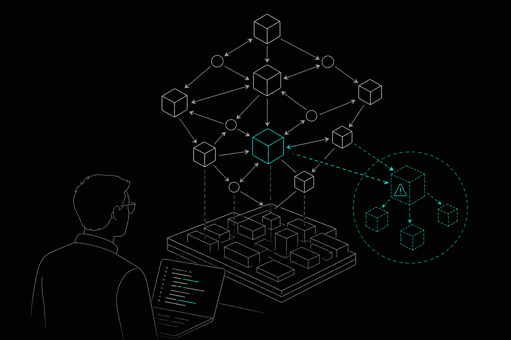

A **code dependency graph** is one of those concepts that sounds theoretical until a "small refactor" takes down three services you didn't know were connected. If you've ever shipped a change that cascaded into a 2am incident, this guide is for you.

We'll cover what a code dependency graph actually is, how to build and read one, where it fits into modern AI-assisted development, and what separates a useful graph from a static snapshot that goes stale the moment you merge.

---

## What Is a Code Dependency Graph?

A code dependency graph is a directed graph where nodes represent units of code — functions, modules, classes, services, or APIs — and edges represent the relationships between them. An edge from node A to node B means A depends on B: A calls B, imports B, or relies on B at runtime.

It answers questions a flat file tree simply can't:

- Which functions call this one?
- If I change this module, what else breaks?
- Where does this API endpoint originate, and who consumes it?
- Is this function dead code, or does something obscure depend on it?

At small scale, you can answer these by reading the code. At 10,000 lines and growing, you can't. At 100,000 lines with two AI coding agents writing in parallel, a dependency graph isn't optional — it's the only way to reason about the codebase safely.

---

## The Anatomy of a Code Dependency Graph

### Nodes

Nodes are the things that exist in your codebase. Depending on the granularity of the tool building the graph, they might represent:

- **Functions and methods** — the most granular level, useful for call-chain analysis
- **Modules or files** — a coarser view, good for understanding import structure
- **Services or packages** — useful for microservice architectures
- **APIs and endpoints** — critical for cross-repo dependency mapping

Most practical graphs mix granularities. You want function-level detail for blast radius analysis but service-level detail for topology diagrams.

### Edges

Edges encode the type of relationship. A call edge is different from an import edge, which is different from a runtime data dependency. Tools that flatten everything into a single "depends on" relationship lose information that matters when you're trying to understand *why* something breaks.

Direction matters here too. If A calls B, that's not the same as B calling A. The direction tells you which node is the consumer and which is the provider — and therefore which node's changes propagate outward.

### Metadata

A bare graph of nodes and edges is useful but limited. The graphs that actually help developers also carry metadata: when a function was last changed, what decision was made when it was written, which tests cover it, and which contracts it's expected to satisfy.

Without metadata, you can trace a path. With it, you can understand the path.

---

## How to Build a Code Dependency Graph

Building a dependency graph comes down to three steps: parsing, linking, and persisting.

### Step 1: Parse the Source

Static analysis tools parse source files into an Abstract Syntax Tree (AST). The AST exposes every function definition, import statement, and call site in a machine-readable form. Tools like tree-sitter handle this across multiple languages without running the code.

### Step 2: Link the Nodes

Once you have ASTs for every file, you resolve references across them. A call to `processPayment()` in one file needs to be linked to the definition of `processPayment()` in another. This resolution step is where most of the complexity lives — name shadowing, dynamic dispatch, and conditional imports all create ambiguity.

For most codebases, a combination of static resolution and heuristic matching gets you 90%+ coverage. The remaining 10% — dynamic calls, reflection, runtime-generated code — usually needs manual annotation or runtime tracing.

### Step 3: Persist and Maintain the Graph

This is where most dependency graph tools fall short. Building the graph once is straightforward. Keeping it current as the codebase evolves is hard.

A graph built from a single commit is useful for a few hours. After the next merge, it's already wrong. Effective dependency graph tooling needs to update incrementally as commits land — not require a full re-index every time.

This is also where the difference between a static dependency graph and a live code graph becomes meaningful.

---

## Reading and Querying a Code Dependency Graph

### Blast Radius Analysis

The most immediately useful query against a dependency graph is blast radius: given a proposed change to node X, which other nodes are affected?

You run a reverse traversal — following edges backward from X to find every caller, every dependent module, every service that imports X's output. The result is the set of things that could break if X changes.

Doing this before you edit, rather than after you deploy, is the difference between a planned refactor and an incident.

### Call Chain Tracing

Call chain tracing follows edges forward: starting from an entry point — an API endpoint, a CLI command, a scheduled job — trace every function called in sequence. This is how you understand execution paths, find where a bug could originate, and verify that a new feature won't collide with an existing one.

### Dead Code Detection

Nodes with no incoming edges — nothing calls them, nothing imports them — are candidates for dead code. A dependency graph makes this visible at a glance. Without one, dead code accumulates silently and makes future analysis harder.

### Cross-Repo and API Topology

In a microservice architecture, dependencies don't stop at the repo boundary. Service A calls Service B's REST endpoint. That call is a dependency, but it won't show up in a single-repo AST parse.

Cross-repo dependency mapping requires tracking API endpoints and service calls explicitly, then linking them across repositories. It's harder to build, but essential for understanding how a change in one service propagates to others.

---

## Code Dependency Graphs in AI-Assisted Development

This is where dependency graphs have become genuinely important — not just theoretically useful.

AI coding agents — Cursor, Claude Code, OpenAI Codex, Gemini CLI — generate code by reasoning over context. The context they receive determines the quality of what they produce. Feed an agent a few files and ask it to refactor a function, and it will do so without knowing that function is called by twelve other modules and two external services.

The result is technically correct code that breaks things the agent never saw.

A live code dependency graph solves this by giving the agent structural awareness before it edits. Instead of loading raw file content into the context window, the agent queries the graph: "What calls this function? What does this function depend on? What's the blast radius of this change?" It gets precise, structured answers rather than hoping the relevant files happen to be in context.

This matters for token efficiency too. Querying a graph for specific relationships is far cheaper than loading entire files to find the same information.

---

## What Makes a Dependency Graph Actually Useful

Not all dependency graph tools are equal. Here's what separates the ones that help from the ones that just add complexity.

### Continuous Updates

A graph that requires manual re-indexing goes stale immediately in an active codebase. Useful graphs update automatically as commits land, without requiring you to remember to run a command.

### Decision Memory

Knowing *what* the graph looks like is useful. Knowing *why* it looks that way is more useful. A function might be structured oddly because of a performance constraint discovered two years ago. A module might have an intentional circular dependency. Without recorded reasoning, the next developer — or the next AI agent — will "fix" things that weren't broken.

### Multi-Agent Coordination

When multiple AI agents work in parallel on the same codebase, they can make conflicting changes without knowing it. A dependency graph that tracks agent intent and detects overlapping work before merge prevents the kind of collision that only surfaces as a broken build at 4pm on a Friday.

### Bi-Temporal History

A graph that only shows current state is useful for today's questions. A graph that tracks both when facts were recorded and when they were valid — a bi-temporal model — lets you ask things like "what did the graph look like before that migration?" or "when did this dependency first appear?" That's a different class of tool entirely.

---

## How Memtrace Approaches the Code Dependency Graph

[Memtrace](https://memtrace.io/) is built around a live, continuously maintained code graph that connects functions, callers, APIs, and tests across a repository. Rather than replacing the tools you already use, it connects via MCP (Model Context Protocol) to Cursor, Claude Code, OpenAI Codex, Gemini CLI, Windsurf, and VS Code — so your agents can query the graph without changing how you work.

A few things worth knowing about how it handles the problems described above:

**Blast radius before any edit.** Memtrace traces all callers and dependent services affected by a proposed change before the edit is made. The agent asks, the graph answers, the edit happens with full context.

**Decision memory via Cortex.** Cortex records the reasoning behind code decisions and makes it queryable via `recall_decision`, `verify_intent`, `get_arc`, `why_is_this_here`, and `governing_contracts`. It's active by default on every tier, including the free Community plan. No equivalent capability is documented by the five main tools in this space.

**Bi-temporal graph history via MemDB.** Memtrace's purpose-built graph database tracks both Transaction Time and Valid Time, enabling rewind and episode replay against graph history. You can query what the graph looked like at any point in the past, not just its current state.

**Multi-agent collision detection via Fleet.** Agents publish intents, acquire leases for destructive work, and log episodes. Class C conflicts — where two agents or engineers are about to make incompatible changes — escalate to a human before merge.

**Code review at every tier.** The built-in reviewer combines AST detectors, YAML rule packs, and graph-backed cross-module checks, with GitHub App posting and `@memtrace` commands. It's available on the free plan, not gated behind a paid tier.

According to the Memtrace benchmark at memtrace.io/benchmark, the graph-query approach produces 84.7% fewer file-content tokens per session and 3.9x more correct results per response token than competing tools.

The Community tier is free with 1,000 graph queries per month. Pro is $9 per month. Teams is $29 per seat per month with self-hosted MemDB for teams that need to keep the graph on their own infrastructure.

---

## Common Mistakes When Working with Dependency Graphs

**Treating the graph as a one-time artifact.** Build it, use it for a week, forget to update it, and you're back to reasoning from stale information. The graph needs to be a live part of your development workflow, not a diagram you generate for a quarterly architecture review.

**Ignoring edge direction.** A dependency from A to B is not the same as a dependency from B to A. Confusing the direction leads to wrong blast radius estimates and missed impact analysis.

**Stopping at the module level.** Module-level graphs are easier to build but miss the function-level detail that matters for precise refactoring. If you can get function-level granularity, use it.

**Not tracking why.** A graph that shows structure without context is useful for navigation but not for decision-making. When you or an agent is deciding whether to change something, knowing the reasoning behind the current design is as important as knowing what depends on it.

**Skipping cross-repo dependencies.** In a microservice architecture, stopping the graph at the repo boundary means missing half the picture. API calls between services are dependencies, even if they don't show up in your import statements.

---

## FAQs

**What is a code dependency graph?**
A code dependency graph is a directed graph where nodes represent units of code — functions, modules, services, or APIs — and edges represent the relationships between them (calls, imports, runtime dependencies). It lets you understand what depends on what across a codebase without reading every file manually.

**How is a code dependency graph different from a call graph?**
A call graph is a specific type of dependency graph focused on function calls: which functions call which other functions. A code dependency graph is broader — it can include module imports, API relationships, service-to-service calls, and data dependencies, not just function calls.

**Why do AI coding agents need a dependency graph?**
AI agents generate code based on the context they receive. Without a dependency graph, they only see the files explicitly loaded into the context window. A graph lets them query structural relationships — blast radius, callers, execution paths — before making changes, which reduces errors and token waste.

**How do you keep a code dependency graph up to date?**
The most reliable approach is incremental, commit-aware updates: the graph updates automatically as code changes land, without requiring a full re-index. Tools that only build the graph in batch require manual intervention to stay current, which means the graph is often stale in active codebases.

**What is blast radius analysis in the context of a dependency graph?**
Blast radius analysis is a reverse traversal of the dependency graph starting from a node you plan to change. It finds every caller, dependent module, and downstream service that could be affected. Running this before editing — rather than after deploying — lets you scope the risk of a refactor accurately.

**What is a bi-temporal dependency graph?**
A bi-temporal graph tracks two time dimensions: when a fact was recorded in the database (Transaction Time) and when it was actually valid in the codebase (Valid Time). This lets you query what the graph looked like at any point in the past, replay episodes, and understand how dependencies evolved over time — not just what they look like today.

**Can a code dependency graph work across multiple repositories?**
Yes, but it requires explicit tracking of API endpoints and service calls across repo boundaries. Single-repo AST parsing won't capture cross-service dependencies. Tools that support cross-repo API topology mapping — tracking which services call which endpoints — extend the graph to cover the full picture in a microservice architecture.

---

## Start with the Graph

A code dependency graph is not a luxury for large teams. It's the foundation for making safe changes in any codebase that has grown past the point where one person holds the full picture in their head.

Build it at function-level granularity. Keep it current. Record the reasoning behind decisions, not just the structure. And if you're running AI agents, give them access to the graph before they edit — not after they break something.

If you want to see what a continuously maintained, queryable code graph looks like in practice, [Memtrace](https://memtrace.io/) offers a free Community tier with no credit card required.
