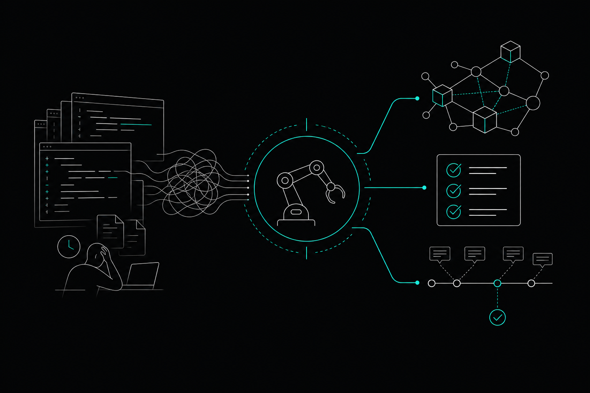

Code review automation is one of the fastest ways engineering teams recover hours lost to manual PR feedback cycles. If your team runs AI coding agents daily, the problem compounds: agents generate code faster than humans can review it, and without structural context, reviewers end up guessing at intent rather than evaluating logic. This article covers what code review automation actually means in practice, where it saves the most time, and how graph-backed tooling changes what automated review can catch.

## What Code Review Automation Actually Means

Automated code review isn't a single tool or a single step. It's a layer of checks that runs before a human ever opens a pull request, flagging issues that would otherwise consume review bandwidth on things a machine can catch reliably.

The most common forms include static analysis and linting (syntax errors, style violations, and simple anti-patterns), AST-based detectors (checks that parse the abstract syntax tree to find structural problems invisible to line-by-line linters), rule packs (configurable YAML or JSON rulesets that enforce team-specific conventions without requiring custom scripts), and cross-module checks (analysis that spans file boundaries to catch dependency violations or API contract breaks).

The gap most teams hit is that the first two categories are well-served by existing tools. Cross-module checks are where automation tends to fall apart, because they require understanding how the codebase connects — not just what a single file contains.

## Where Manual Review Time Actually Goes

Before you can cut review time, it helps to be specific about where it goes.

**Reviewing changes without context.** A reviewer opens a PR and spends ten minutes tracing callers to understand what the changed function actually does. That work should happen before the PR is opened, not during review.

**Catching issues a tool should have caught.** Style nits, obvious null-pointer risks, missing error handling in a pattern the team has already documented. These aren't judgment calls — they're rules. Automating them frees reviewers for decisions that actually require judgment.

**Merge conflicts from parallel work.** Two engineers or two agents touch overlapping code. Neither knows until the merge. The review then becomes a debugging session rather than a quality check.

**Re-explaining why code is structured a certain way.** A reviewer asks "why does this function exist?" and the author either knows from memory or has to dig through git history. If the reasoning was never recorded, it's effectively lost.

Each of these is a different problem with a different automation solution.

## Graph-Backed Review vs. File-Level Review

Most automated review tools operate at the file level. They read a diff, apply rules, and return comments. That works for syntax and style. It doesn't work for catching a change that silently breaks a service three modules away.

Graph-backed review works differently. Before flagging anything, it consults a live map of how functions, callers, APIs, and tests connect across the repository. A change to a utility function gets evaluated not just on its own terms but in the context of every caller and every downstream service that depends on it.

This is what blast radius analysis does: it traces all callers and dependent services before any edit, so the reviewer — human or automated — knows the full scope of what changed. A one-line modification to a shared authentication helper looks very different when you can see it's called by fourteen services rather than one.

## How AI Agents Change the Code Review Problem

Teams running Cursor, Claude Code, or OpenAI Codex daily are generating code at a pace that manual review can't match. Volume isn't the only issue. Agents also lose context between sessions, which means they sometimes rewrite logic that already exists, contradict decisions made in earlier sessions, or introduce changes that conflict with work another agent is doing in parallel.

These aren't review problems in the traditional sense. They're context problems that show up at review time.

Automated review that only looks at the diff misses all of this. It can't tell you that the function an agent just wrote duplicates one that already exists. It can't tell you that the pattern an agent chose was explicitly rejected six weeks ago and the reasoning was documented. It can't tell you that two agents are currently editing overlapping code and a merge collision is incoming.

Addressing these problems requires review automation that's connected to the codebase's history and structure — not just its current diff.

## What a Code Review Automation Stack Looks Like in Practice

A practical automation stack for a team running AI agents has several layers working together.

### Deterministic checks at commit or PR time

AST detectors and YAML rule packs run on every change without human involvement. These catch structural problems and convention violations before anyone sees the PR. The rules should be configurable by the team, not locked to a vendor's defaults.

### Cross-module graph checks

These run against a live code graph, not a snapshot. They answer questions like: does this change break any callers? Does it violate an API contract defined elsewhere in the repository? Does it introduce a dependency cycle? These checks are only as good as the graph they query, which is why continuous, commit-aware graph maintenance matters. A graph rebuilt in batch once a day will miss changes made this morning.

### Decision recall at review time

When a reviewer or an agent asks "why is this here?", the answer shouldn't require a git archaeology session. A decision-memory system that records the reasoning behind code choices and makes it queryable at review time changes the nature of the review conversation. Instead of reconstructing intent, the reviewer is evaluating whether the current change aligns with documented intent.

### Parallel work collision detection

When multiple agents or engineers are working simultaneously, a review automation system that only looks at individual PRs will miss collisions until merge. Intent publishing and lease acquisition for destructive work catches these before they become merge conflicts — a fundamentally different intervention point.

## How Memtrace Fits Into This Stack

[Memtrace](https://memtrace.io/) builds and maintains a local code graph that connects functions, callers, APIs, and tests across a repository, and its code review tooling is built directly on top of that graph.

The code reviewer combines AST detectors, configurable YAML rule packs, and graph-backed cross-module checks. It posts findings directly to GitHub via the GitHub App and supports `@memtrace` commands in PR comments. This is available on every tier, including the free Community plan — worth noting because most tools gate automated review behind paid tiers.

Cortex, Memtrace's decision-memory system, is also active by default on every tier. It records and recalls the reasoning behind code decisions using queries like `recall_decision`, `why_is_this_here`, and `governing_contracts`. When an agent or a human reviewer asks why a particular pattern was chosen, Cortex returns the documented reasoning rather than silence.

Fleet handles the parallel-work problem. It uses intent publishing and lease acquisition to detect overlapping agent and engineer work before merge, with human escalation for Class C conflicts. This isn't a post-merge diff tool — it's a pre-merge coordination layer.

The graph itself stays current as the codebase evolves without manual re-indexing, which is what makes the cross-module checks and blast radius analysis reliable rather than approximate. Memtrace connects to Cursor, Claude Code, OpenAI Codex, Gemini CLI, Windsurf, and VS Code via MCP, so it plugs into whatever tools your team already uses without replacing them.

For teams on the Teams plan at $29/seat/month, MemDB can be self-hosted, giving you full control over graph storage. Enterprise adds air-gapped deployment for teams with stricter data requirements.

## Building the Habit Around Automation

The teams that get the most from code review automation treat automated findings as first-class feedback, not noise to dismiss. That means a few practical things.

Keep rule packs under version control and review them the same way you review code. Rules that are wrong or outdated generate noise, and noisy automation gets ignored.

Make blast radius analysis a required step before opening a PR, not an optional one. If an agent is generating the PR, the graph query should happen before the agent commits. The goal is to surface scope information before a human has to spend time reconstructing it.

Use decision recall actively during review. When a change contradicts a documented decision, that's worth surfacing in the PR comment — not just in a reviewer's head. Automation that surfaces this context shifts the review from "I think this is wrong" to "this conflicts with the decision recorded on this date for this reason."

Review time doesn't shrink because you added a tool. It shrinks because the tool handles the work that should never have required a human in the first place.

---

## FAQs

**What is code review automation?**
Code review automation is the practice of running programmatic checks on code changes before or during a pull request, catching issues that can be evaluated by rules rather than human judgment. This includes static analysis, AST-based structural checks, configurable rule packs, and graph-backed cross-module analysis.

**What kinds of issues can automated code review catch?**
Automated review handles syntax errors, style violations, structural anti-patterns, missing error handling, API contract breaks, and dependency violations. Graph-backed tools can also catch cross-module issues like a change that breaks callers in a different service — something file-level tools miss entirely.

**How does code review automation work with AI coding agents?**
AI agents generate code faster than manual review can handle, and they lose context between sessions. Automated review tools that connect to a live code graph can catch duplicated logic, contradicted past decisions, and parallel agent conflicts before they reach merge — which is the main problem that diff-only automation misses.

**What is blast radius analysis in the context of code review?**
Blast radius analysis traces all callers and dependent services affected by a proposed change before the edit is made or reviewed. It gives reviewers and agents a clear picture of scope, so a change to a shared utility function is evaluated with full knowledge of what depends on it.

**Does automated code review replace human reviewers?**
No. Automated review handles deterministic checks — things that have a right answer according to rules. Human reviewers handle judgment calls: architecture decisions, trade-offs, and whether the approach is the right one for the problem. Automation reduces the time humans spend on the first category so they can focus on the second.

**How does decision recall help during code review?**
Decision recall lets reviewers query why a particular piece of code was written the way it was, including the reasoning documented at the time. This replaces git archaeology and memory with a queryable record — especially useful when reviewing AI-generated code that may contradict earlier decisions.

**What should a team look for when evaluating code review automation tools?**
Look for configurable rules that your team controls, cross-module checks backed by a live code graph rather than a stale snapshot, integration with your existing tools without requiring a workflow change, and availability at the tier your team actually uses rather than gated behind enterprise plans.
